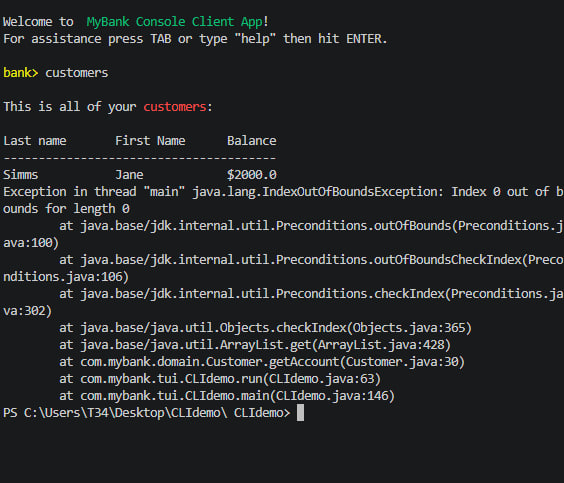
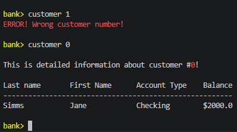

# UI Lab 2 

# Звіт про виконання практичної роботи
## Тема: Розробка консольного користувацького інтерфейсу (CLI) з підтримкою інтерактивного введення (JLine/JAnsi)

---

### 1. Мета роботи
Навчитися будувати інтерактивні консольні інтерфейси користувача (CLI) в середовищі Java, опанувати роботу з потоками введення-виведення за допомогою бібліотек `JLine` та `JAnsi`, а також реалізувати завантаження та обробку даних клієнтів банку із зовнішнього бінарного файлу даних (`test.dat`).

---

### 2. Завдання роботи
1. Налаштувати структуру проєкту в IDE Visual Studio Code з підключенням сторонніх компільованих бібліотек.
2. Інтегрувати класи `DataSource` та `Bank` із попередніх лабораторних робіт для автоматичного зчитування бази даних клієнтів.
3. Організувати обробку консольних команд (`help`, `customers`, `customer 'index'`, `exit`) та забезпечити валідацію введених користувачем індексів.
4. Налаштувати автодоповнення команд у терміналі за допомогою клавіші `TAB`.

---

### 3. Скріни роботи

